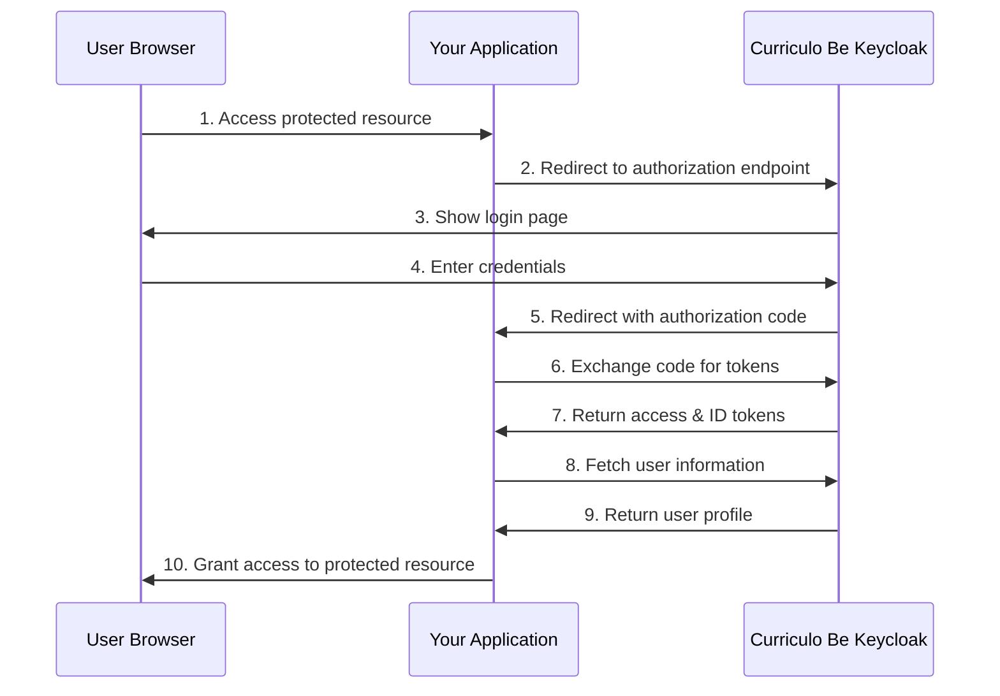

# 🔐 Curriculo Be OAuth 2.0/OpenID Connect Integration Guide

## Overview

This document provides comprehensive integration documentation for clients (like **curriculo-be**) who want to integrate their systems with **Curriculo Be's** authentication infrastructure using OAuth 2.0/OpenID Connect standards.

The test server in this repository demonstrates the complete authentication flow and serves as a reference implementation for client integration.

---

## 📋 Table of Contents

1. [Prerequisites](#prerequisites)
2. [Authentication Flow](#authentication-flow)
3. [Environment Configuration](#environment-configuration)
4. [API Endpoints](#api-endpoints)
5. [Integration Steps](#integration-steps)
6. [Code Examples](#code-examples)
7. [Session Management](#session-management)
8. [Error Handling](#error-handling)
9. [Security Considerations](#security-considerations)
10. [Testing Your Integration](#testing-your-integration)
11. [Troubleshooting](#troubleshooting)
12. [Support](#support)

---

## Prerequisites

### Required Information from Curriculo Be

Before starting the integration, you will need the following information from Curriculo Be:

- **Keycloak Realm Endpoint**: The base URL for the authentication realm
- **Client ID**: Your unique client identifier
- **Client Secret**: Your client secret (keep this secure!)
- **Allowed Redirect URIs**: URLs where users will be redirected after authentication
- **Allowed Logout URIs**: URLs where users will be redirected after logout

### Technical Requirements

- **Node.js 16+** (for running the test server)
- **HTTPS endpoint** for production (required for OAuth 2.0)
- **Web server** capable of handling HTTP redirects
- **Session management** capability in your application

---

## Authentication Flow

### OAuth 2.0 Authorization Code Flow

The integration uses the **Authorization Code** flow, which is the most secure option for web applications:



### Step-by-Step Process

1. **User Authentication Request**: User tries to access a protected resource
2. **Authorization Redirect**: Redirect user to Curriculo Be's login page
3. **User Login**: User enters their Curriculo Be credentials
4. **Authorization Code**: Keycloak redirects back with an authorization code
5. **Token Exchange**: Your server exchanges the code for access tokens
6. **User Information**: Fetch user profile using the access token
7. **Session Creation**: Create a session in your application
8. **Access Granted**: User can now access protected resources

---

## Environment Configuration

### Environment Variables

Configure these environment variables in your application:

```bash
# Curriculo Be Keycloak Configuration
KEYCLOAK_ENDPOINT=https://auth-dev.curriculobe.com.br/realms/bestema-dev
KEYCLOAK_CLIENT_ID=your_client_id_here
KEYCLOAK_CLIENT_SECRET=your_client_secret_here
KEYCLOAK_REDIRECT_URI=https://yourdomain.com/auth/callback
KEYCLOAK_LOGOUT_REDIRECT_URI=https://yourdomain.com/auth/logout-success
KEYCLOAK_SCOPE=openid profile email

# Your Application Configuration
PORT=3000
SESSION_SECRET=your_session_secret_here
```

### Configuration Object (TypeScript)

```typescript
interface KeycloakConfig {
  endpoint: string;           // Keycloak realm endpoint
  clientId: string;          // Your client ID
  clientSecret: string;      // Your client secret
  redirectUri: string;       // Your callback URL
  logoutRedirectUri: string; // Your logout callback URL
  scope: string;             // Requested scopes
}

const keycloakConfig: KeycloakConfig = {
  endpoint: process.env.KEYCLOAK_ENDPOINT || '',
  clientId: process.env.KEYCLOAK_CLIENT_ID || '',
  clientSecret: process.env.KEYCLOAK_CLIENT_SECRET || '',
  redirectUri: process.env.KEYCLOAK_REDIRECT_URI || '',
  logoutRedirectUri: process.env.KEYCLOAK_LOGOUT_REDIRECT_URI || '',
  scope: process.env.KEYCLOAK_SCOPE || 'openid profile email',
};
```

---

## API Endpoints

### Curriculo Be Keycloak Endpoints

| Endpoint | Purpose | Method |
|----------|---------|---------|
| `/protocol/openid-connect/auth` | Authorization endpoint | GET |
| `/protocol/openid-connect/token` | Token endpoint | POST |
| `/protocol/openid-connect/userinfo` | User information endpoint | GET |
| `/protocol/openid-connect/logout` | Logout endpoint | GET |

### Your Application Endpoints (Required)

| Endpoint | Purpose | Description |
|----------|---------|-------------|
| `/auth/login` | Initiate login | Redirects to Keycloak |
| `/auth/callback` | Handle callback | Processes authorization code |
| `/auth/logout` | Initiate logout | Redirects to Keycloak logout |
| `/auth/logout-success` | Logout confirmation | Shows logout success page |

---

## Integration Steps

### Step 1: Set Up Authorization Endpoint

Create an endpoint that redirects users to Curriculo Be for authentication:

```typescript
app.get('/auth/login', (req: Request, res: Response) => {
  const authUrl = 
    `${keycloakConfig.endpoint}/protocol/openid-connect/auth?` +
    `client_id=${keycloakConfig.clientId}&` +
    `redirect_uri=${encodeURIComponent(keycloakConfig.redirectUri)}&` +
    `response_type=code&` +
    `scope=${encodeURIComponent(keycloakConfig.scope)}`;
  
  res.redirect(authUrl);
});
```

### Step 2: Handle Authorization Callback

Process the authorization code returned by Keycloak:

```typescript
app.get('/auth/callback', async (req: Request, res: Response) => {
  const authCode = req.query.code as string;
  
  if (!authCode) {
    return res.status(400).json({ error: 'Authorization code not found' });
  }
  
  try {
    // Exchange code for tokens
    const tokenResponse = await exchangeCodeForTokens(authCode);
    
    // Fetch user information
    const userInfo = await fetchUserInfo(tokenResponse.access_token);
    
    // Create session in your application
    const sessionId = createUserSession(tokenResponse, userInfo);
    
    // Set session cookie
    res.cookie('sessionId', sessionId, { 
      httpOnly: true, 
      secure: process.env.NODE_ENV === 'production',
      maxAge: 24 * 60 * 60 * 1000 // 24 hours
    });
    
    res.redirect('/dashboard');
  } catch (error) {
    console.error('Authentication error:', error);
    res.redirect('/login?error=auth_failed');
  }
});
```

### Step 3: Token Exchange Function

```typescript
async function exchangeCodeForTokens(authCode: string) {
  const tokenEndpoint = `${keycloakConfig.endpoint}/protocol/openid-connect/token`;
  
  const params = new URLSearchParams();
  params.append('grant_type', 'authorization_code');
  params.append('client_id', keycloakConfig.clientId);
  params.append('client_secret', keycloakConfig.clientSecret);
  params.append('code', authCode);
  params.append('redirect_uri', keycloakConfig.redirectUri);
  
  const response = await axios.post(tokenEndpoint, params, {
    headers: {
      'Content-Type': 'application/x-www-form-urlencoded',
    },
  });
  
  return response.data;
}
```

### Step 4: Fetch User Information

```typescript
async function fetchUserInfo(accessToken: string) {
  const userInfoEndpoint = `${keycloakConfig.endpoint}/protocol/openid-connect/userinfo`;
  
  const response = await axios.get(userInfoEndpoint, {
    headers: {
      'Authorization': `Bearer ${accessToken}`
    }
  });
  
  return response.data;
}
```

### Step 5: Implement Logout

```typescript
app.get('/auth/logout', (req: Request, res: Response) => {
  const sessionId = req.cookies.sessionId;
  const userSession = getUserSession(sessionId);
  
  if (userSession) {
    // Clear session
    destroyUserSession(sessionId);
    
    // Construct logout URL
    const logoutUrl = 
      `${keycloakConfig.endpoint}/protocol/openid-connect/logout?` +
      `client_id=${keycloakConfig.clientId}&` +
      `post_logout_redirect_uri=${encodeURIComponent(keycloakConfig.logoutRedirectUri)}` +
      (userSession.idToken ? `&id_token_hint=${userSession.idToken}` : '');
    
    // Clear cookie
    res.clearCookie('sessionId');
    res.redirect(logoutUrl);
  } else {
    res.redirect('/auth/logout-success');
  }
});
```

---

## Code Examples

### Complete Express.js Integration Example

```typescript
import express from 'express';
import axios from 'axios';
import { URLSearchParams } from 'url';

const app = express();

// Configuration
const keycloakConfig = {
  endpoint: process.env.KEYCLOAK_ENDPOINT!,
  clientId: process.env.KEYCLOAK_CLIENT_ID!,
  clientSecret: process.env.KEYCLOAK_CLIENT_SECRET!,
  redirectUri: process.env.KEYCLOAK_REDIRECT_URI!,
  logoutRedirectUri: process.env.KEYCLOAK_LOGOUT_REDIRECT_URI!,
  scope: 'openid profile email',
};

// Session storage (use a proper session store in production)
const sessions = new Map();

// Middleware to check authentication
function requireAuth(req: any, res: any, next: any) {
  const sessionId = req.cookies.sessionId;
  const userSession = sessions.get(sessionId);
  
  if (!userSession || !userSession.isAuthenticated) {
    return res.redirect('/auth/login');
  }
  
  req.user = userSession.userInfo;
  next();
}

// Routes
app.get('/auth/login', (req, res) => {
  const authUrl = 
    `${keycloakConfig.endpoint}/protocol/openid-connect/auth?` +
    `client_id=${keycloakConfig.clientId}&` +
    `redirect_uri=${encodeURIComponent(keycloakConfig.redirectUri)}&` +
    `response_type=code&` +
    `scope=${encodeURIComponent(keycloakConfig.scope)}`;
  
  res.redirect(authUrl);
});

app.get('/auth/callback', async (req, res) => {
  // Implementation from Step 2 above
});

app.get('/auth/logout', (req, res) => {
  // Implementation from Step 5 above
});

// Protected route example
app.get('/dashboard', requireAuth, (req, res) => {
  res.json({
    message: 'Welcome to your dashboard!',
    user: req.user
  });
});

app.listen(3000, () => {
  console.log('Server running on port 3000');
});
```

### React.js Client Example

```jsx
import React, { useState, useEffect } from 'react';

function App() {
  const [user, setUser] = useState(null);
  const [loading, setLoading] = useState(true);

  useEffect(() => {
    checkAuthStatus();
  }, []);

  const checkAuthStatus = async () => {
    try {
      const response = await fetch('/api/user');
      if (response.ok) {
        const userData = await response.json();
        setUser(userData);
      }
    } catch (error) {
      console.error('Error checking auth status:', error);
    } finally {
      setLoading(false);
    }
  };

  const handleLogin = () => {
    window.location.href = '/auth/login';
  };

  const handleLogout = () => {
    window.location.href = '/auth/logout';
  };

  if (loading) {
    return <div>Loading...</div>;
  }

  return (
    <div>
      {user ? (
        <div>
          <h1>Welcome, {user.preferred_username}!</h1>
          <button onClick={handleLogout}>Logout</button>
        </div>
      ) : (
        <div>
          <h1>Please login</h1>
          <button onClick={handleLogin}>Login with Curriculo Be</button>
        </div>
      )}
    </div>
  );
}

export default App;
```

---

## Session Management

### User Session Interface

```typescript
interface UserSession {
  id: string;
  idToken: string;
  accessToken: string;
  refreshToken?: string;
  userInfo: {
    sub: string;
    preferred_username: string;
    email: string;
    email_verified: boolean;
    name: string;
    given_name: string;
    family_name: string;
  };
  isAuthenticated: boolean;
  expiresAt: Date;
}
```

### Session Storage Recommendations

**For Development:**
- In-memory storage (Map/Object)

**For Production:**
- Redis
- Database (PostgreSQL, MongoDB)
- JWT with proper validation

### Token Refresh (Optional)

```typescript
async function refreshAccessToken(refreshToken: string): Promise<TokenResponse> {
  const tokenEndpoint = `${keycloakConfig.endpoint}/protocol/openid-connect/token`;
  
  const params = new URLSearchParams();
  params.append('grant_type', 'refresh_token');
  params.append('client_id', keycloakConfig.clientId);
  params.append('client_secret', keycloakConfig.clientSecret);
  params.append('refresh_token', refreshToken);
  
  const response = await axios.post(tokenEndpoint, params, {
    headers: {
      'Content-Type': 'application/x-www-form-urlencoded',
    },
  });
  
  return response.data;
}
```

---

## Error Handling

### Common Error Scenarios

1. **Invalid Authorization Code**
2. **Token Exchange Failure**
3. **Network Connectivity Issues**
4. **Invalid/Expired Tokens**
5. **User Information Fetch Failure**

### Error Response Format

```typescript
interface AuthError {
  error: string;
  error_description?: string;
  timestamp: string;
  code?: string;
}
```

### Error Handling Example

```typescript
app.get('/auth/callback', async (req, res) => {
  try {
    // ... authentication logic
  } catch (error) {
    console.error('Authentication error:', error);
    
    let errorMessage = 'Authentication failed';
    let errorCode = 'AUTH_FAILED';
    
    if (error.response) {
      // Keycloak returned an error
      errorMessage = error.response.data.error_description || errorMessage;
      errorCode = error.response.data.error || errorCode;
    }
    
    res.redirect(`/login?error=${errorCode}&message=${encodeURIComponent(errorMessage)}`);
  }
});
```

---

## Security Considerations

### Required Security Measures

1. **HTTPS Only**: Use HTTPS in production for all OAuth endpoints
2. **Secure Cookies**: Set `secure` and `httpOnly` flags on session cookies
3. **CSRF Protection**: Implement CSRF tokens for state management
4. **Input Validation**: Validate all incoming parameters
5. **Secret Management**: Store client secrets securely (environment variables, secret management systems)

### Additional Security Headers

```typescript
app.use((req, res, next) => {
  res.setHeader('X-Content-Type-Options', 'nosniff');
  res.setHeader('X-Frame-Options', 'DENY');
  res.setHeader('X-XSS-Protection', '1; mode=block');
  res.setHeader('Strict-Transport-Security', 'max-age=31536000; includeSubDomains');
  next();
});
```

### State Parameter (Recommended)

```typescript
// Generate and store state parameter
const state = crypto.randomBytes(32).toString('hex');
req.session.oauthState = state;

const authUrl = 
  `${keycloakConfig.endpoint}/protocol/openid-connect/auth?` +
  `client_id=${keycloakConfig.clientId}&` +
  `redirect_uri=${encodeURIComponent(keycloakConfig.redirectUri)}&` +
  `response_type=code&` +
  `scope=${encodeURIComponent(keycloakConfig.scope)}&` +
  `state=${state}`;

// In callback, verify state parameter
if (req.query.state !== req.session.oauthState) {
  throw new Error('Invalid state parameter');
}
```

---

## Testing Your Integration

### Running the Test Server

1. **Clone this repository**
2. **Install dependencies**: `npm install`
3. **Configure environment variables**: Create `.env` file
4. **Start the server**: `npm start`
5. **Open browser**: Navigate to `http://localhost:3000`

### Testing Checklist

- [ ] Login flow works correctly
- [ ] Authorization code is received
- [ ] Tokens are exchanged successfully
- [ ] User information is fetched
- [ ] Session is created properly
- [ ] Logout flow works correctly
- [ ] Error scenarios are handled
- [ ] Security headers are set
- [ ] HTTPS works in production

### Manual Testing Steps

1. **Test Login Flow**:
   - Access your application
   - Click login button
   - Verify redirect to Curriculo Be
   - Login with test credentials
   - Verify redirect back to your app
   - Check that user is authenticated

2. **Test Logout Flow**:
   - From authenticated state
   - Click logout button
   - Verify redirect to Curriculo Be logout
   - Verify redirect back to your app
   - Check that user is logged out

3. **Test Error Scenarios**:
   - Invalid client credentials
   - Network connectivity issues
   - Malformed authorization codes

---

## Troubleshooting

### Common Issues and Solutions

#### 1. "Invalid redirect URI" Error

**Problem**: Keycloak rejects the redirect URI
**Solution**: 
- Verify the redirect URI in your Keycloak client configuration
- Ensure exact match including protocol (http/https)
- Check for trailing slashes

#### 2. "Invalid client" Error

**Problem**: Client ID or client secret is incorrect
**Solution**:
- Verify client credentials with Curriculo Be
- Check environment variable configuration
- Ensure no extra spaces or characters

#### 3. "CORS" Errors

**Problem**: Cross-origin requests blocked
**Solution**:
- Configure CORS headers properly
- Ensure same-origin for sensitive operations
- Use server-side redirects instead of AJAX calls for OAuth

#### 4. Session Issues

**Problem**: User sessions not persisting
**Solution**:
- Check cookie configuration
- Verify session storage implementation
- Ensure proper session cleanup

#### 5. Token Validation Failures

**Problem**: Access tokens are rejected
**Solution**:
- Check token expiration
- Verify token format
- Implement token refresh logic

### Debug Mode

Enable debug logging in your application:

```typescript
const DEBUG = process.env.NODE_ENV === 'development';

function debugLog(message: string, data?: any) {
  if (DEBUG) {
    console.log(`[DEBUG] ${message}`, data || '');
  }
}

// Use throughout your integration
debugLog('Starting authentication flow');
debugLog('Received authorization code', authCode);
debugLog('Token response', tokenResponse);
```

---

## Support

### Getting Help

For integration support and questions:

1. **Technical Documentation**: Refer to this guide and the test server code
2. **Issue Reporting**: Create issues in this repository for bugs or questions
3. **Direct Support**: Contact Curriculo Be integration team
4. **Test Environment**: Use the provided test server for validation

### Contact Information

- **Email**: [integration-support@curriculobe.com.br]
- **Documentation**: This repository
- **Test Environment**: `https://auth-dev.curriculobe.com.br`

### SLA and Support Hours

- **Response Time**: 24-48 hours for integration questions
- **Support Hours**: Monday-Friday, 9 AM - 6 PM (Brazil time)
- **Emergency Contact**: For production issues only

---

## Appendix

### Keycloak Token Response Format

```json
{
  "access_token": "eyJhbGciOiJSUzI1NiIsInR5cCI6IkpXVCJ9...",
  "expires_in": 300,
  "refresh_expires_in": 1800,
  "refresh_token": "eyJhbGciOiJIUzI1NiIsInR5cCI6IkpXVCJ9...",
  "token_type": "Bearer",
  "id_token": "eyJhbGciOiJSUzI1NiIsInR5cCI6IkpXVCJ9...",
  "not-before-policy": 0,
  "session_state": "uuid-here",
  "scope": "openid profile email"
}
```

### UserInfo Response Format

```json
{
  "sub": "user-uuid-here",
  "email_verified": true,
  "preferred_username": "john.doe",
  "given_name": "John",
  "family_name": "Doe",
  "email": "john.doe@example.com",
  "name": "John Doe"
}
```

### Environment Variables Reference

```bash
# Required
KEYCLOAK_ENDPOINT=https://auth-dev.curriculobe.com.br/realms/bestema-dev
KEYCLOAK_CLIENT_ID=your_client_id
KEYCLOAK_CLIENT_SECRET=your_client_secret
KEYCLOAK_REDIRECT_URI=https://yourdomain.com/auth/callback
KEYCLOAK_LOGOUT_REDIRECT_URI=https://yourdomain.com/auth/logout-success

# Optional
KEYCLOAK_SCOPE=openid profile email
PORT=3000
SESSION_SECRET=your_session_secret
NODE_ENV=production
```

---

**© 2024 Curriculo Be - OAuth 2.0/OpenID Connect Integration Guide** 